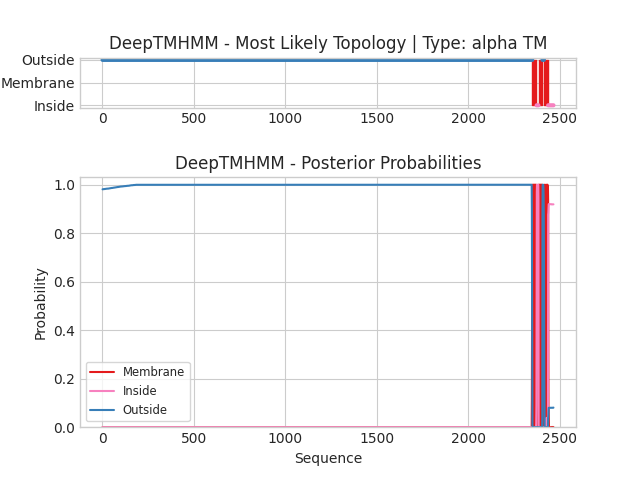

## DeepTMHMM - Predictions
Predicted topologies can be downloaded in [.gff3 format](TMRs.gff3) and [.3line format](predicted_topologies.3line)

You can download the probabilities used to generate this plot [here](ref|XP_023931987.1|_probs.csv)
### Predicted Topologies
```
>ref|XP_023931987.1| | TM
MRWSIELLNRDSGVLNGRRLTDTYIPGVKFGLQITATCGHPETAFTALKQTFPALVTTETQCAPNGTSVLPGILGFTERPNYDNELYHNEVPVVNIGMGSLLTSPGESVLHVAASYETRSKVVSEVLKQLNWKYIAVLYSNDATGRTRVDIMRDMLRRYDLCATLTETVDPGLSDQDGDVVIKKLISFGITGVLYVGSQDPLSVLFNAANRAARKNAKFNFQWILDDIIDEISALSNMPYTRGVLYIRDAVQDIYEFKDHWAGLDPTRPPAENPFFAEQYMTEETCRLPSAFHQLYISYISCPTVTKEERLRRYAKDPMRGFVNLAVDTVFTYAKALKEAQSTKCQTRGMCQDFMRMTHKEFASRFLKTVNFTYTMNERVQSLENRKVAFDKGYLSNPEVDVINIQVDKHVKVGDYRAGLLSLNTSLIRMYDARRTGRLAEVPKSLCQVSHCNCMSNFKSSDNVHSQQGDLIIGGVFSTRQKGSTLHTCRSIDSVQMQLVEAFKYAVLKVNRGEASVRLPPGIRLGTTIYDDCEDPYITKASQSALKSLDAIVAVSPNLPHMAVHDTLDGFNIPLISADPSLSLPREVEIQILLHILLHNDWRFVQVVYSDDSYGNASSREFKAEALKNGICVVQLVCFKNANAAEAASLLDKYPNTKVVIILLSRPHIVRMFLYSMRPRRGEYILIGNSVLGNSNTAVGGEDIVSTGTLAVNVQYPNNTDFFSHLNQLTAKSGSTLLFQKWYEALFNCTLDIKVNIAFQKCIQPYSTPITSARGFKLVPQHQLVIETVYSVAEGLERTLRRYCPGNIDRICPAFRNAPDKNLVVEREIKEVFQRKAIPATFKILQFKGKNEGYEEVGQFNEATKKLHLDDVGLSGISLSSCPGACYVCNYVYQHQDMVIIPGDILIAGIFNIHDKGSSPFTCGDIRNGPANIQGAKAVQYAIETIANGTTPVSLKGVKLGAVILDGCSSAARAGNLISSAYTGLLGLKQFRDIKVWMVEGADMLEEALPTLKVMGLPVITTTTTDSQLNQELQLYPKIYRSVPTSGHLVTGILQFLKEMGWNRVQVIHSTDTYGKNMADIFGRLAESAGVCVQQTHFISNKEESEKLLSVLLSSFDASVVVLFTSIEDISEGILTAKQKLTNDPLRLLIFLDDFSATSRISPSLLEGTVLFQIKELDLDNFSAYLNTQKFNGTPKNPWWDEYYARLFKCNLPGQHKYNMSCQNDSSLRVTDAPDYVHQPFIWGTIQAVYAFAQALDSLLNERCGADNDGLCGAFTTDHNITAALAAKLNGVSMDDGFGKVFKFTSENGTVNYMVHRYSNDVIEQIGTYRTFQRSLTLTNPTLKDYYGSVSARCDGLCSQTCFAKMKTAAKITKDKQGFVDGDVIFAGIFDVHQKSLQPLACGPLRDQNGFQLTEAFLYALNLVNTHRGQFQDILRGVKLGGILLDSCESPARAATLVDNIQSGRVSLSNSTVSKFIAAYIAGPTSASSRTVAEVLKPYGVPLLSYAATSTDLKNQLKYPTFLRTVPSDGKQARAILAVLKRFNIEYVQLVTSSGPYGDPMAKDLLELAGESGVCIAQHLVLRVTKTVSVKVAANSTLHALLKKPPRVAVLALEREHVRELLLAFNSSTNAKKQKFLFIGTDTWQRDLSVVAGLEDIAEGALTLGLETIDVQDYDTSLFLKHPNNYFSNPWFEEYYQWLHQCSLQGDGVFNKLCPLQTSQIPPTKYKQDKLVFYTIAAVHAMAHGLHSVLLDTCGAQYYGLCSNFTKSGDKYQQLLKSTKLANFTDITGRPFEFQDGESVRGYDLFRFGREALGGYLYSTIGDYYYETLTITSPDDNFDVPYSNCSHKHSCRECPTLGPKKTRIMISDKQTIKETSKMYVVAVMDVHQRGRNQFECGPLNVQSYYQLYALQIALRKGNADSLGLFVIDACSHSIRAVNDIYSFQGGCGIIGETAPIDLKVRPEMTMAYVIMGPDNVDAARAFLTSQEIPIVLPSVAPAVPNKYVFSTMPSDFNKAQLLISILQSLEWTHVMVVSSSSDRSQAATTAFFNAVKNKTNICIGKQIIMGENATEDDARDFVNNLNSTSDARVVVYFTDVKHTELLWSGSDLSQLVWIGFSHGENEAKENSDRVSGSITISPQTLDMRDISNTLVGSRPDITNDIPPDWFEEFWQLINGCKISSSKFVQKQFTRECGDSEQISSNEIRMDPSVSHTFLAGSILREAALTSECIPGDRNCFTKALHTTFVQVPDATTKFSFNNTLGFEIRNFQSKSKVHVKIGSWDTGAMHLSIDVRKYQGPIAKGGSNCTSENCPCLKNPVVTFNQSVTVATPSQNEYITTLPAVDSRFVSAIGIIVSMFIGIGVLLTLVLFVVFCVAYPNYKNIGTTLLGYYGLFGVLVIFLHTLAFIYYPSSTVCGFRRFLLGYSYAICFSAFLIKVLDIWRIGNDVVHLRHGSNTHDRHFWGCHMEA
OOOOOOOOOOOOOOOOOOOOOOOOOOOOOOOOOOOOOOOOOOOOOOOOOOOOOOOOOOOOOOOOOOOOOOOOOOOOOOOOOOOOOOOOOOOOOOOOOOOOOOOOOOOOOOOOOOOOOOOOOOOOOOOOOOOOOOOOOOOOOOOOOOOOOOOOOOOOOOOOOOOOOOOOOOOOOOOOOOOOOOOOOOOOOOOOOOOOOOOOOOOOOOOOOOOOOOOOOOOOOOOOOOOOOOOOOOOOOOOOOOOOOOOOOOOOOOOOOOOOOOOOOOOOOOOOOOOOOOOOOOOOOOOOOOOOOOOOOOOOOOOOOOOOOOOOOOOOOOOOOOOOOOOOOOOOOOOOOOOOOOOOOOOOOOOOOOOOOOOOOOOOOOOOOOOOOOOOOOOOOOOOOOOOOOOOOOOOOOOOOOOOOOOOOOOOOOOOOOOOOOOOOOOOOOOOOOOOOOOOOOOOOOOOOOOOOOOOOOOOOOOOOOOOOOOOOOOOOOOOOOOOOOOOOOOOOOOOOOOOOOOOOOOOOOOOOOOOOOOOOOOOOOOOOOOOOOOOOOOOOOOOOOOOOOOOOOOOOOOOOOOOOOOOOOOOOOOOOOOOOOOOOOOOOOOOOOOOOOOOOOOOOOOOOOOOOOOOOOOOOOOOOOOOOOOOOOOOOOOOOOOOOOOOOOOOOOOOOOOOOOOOOOOOOOOOOOOOOOOOOOOOOOOOOOOOOOOOOOOOOOOOOOOOOOOOOOOOOOOOOOOOOOOOOOOOOOOOOOOOOOOOOOOOOOOOOOOOOOOOOOOOOOOOOOOOOOOOOOOOOOOOOOOOOOOOOOOOOOOOOOOOOOOOOOOOOOOOOOOOOOOOOOOOOOOOOOOOOOOOOOOOOOOOOOOOOOOOOOOOOOOOOOOOOOOOOOOOOOOOOOOOOOOOOOOOOOOOOOOOOOOOOOOOOOOOOOOOOOOOOOOOOOOOOOOOOOOOOOOOOOOOOOOOOOOOOOOOOOOOOOOOOOOOOOOOOOOOOOOOOOOOOOOOOOOOOOOOOOOOOOOOOOOOOOOOOOOOOOOOOOOOOOOOOOOOOOOOOOOOOOOOOOOOOOOOOOOOOOOOOOOOOOOOOOOOOOOOOOOOOOOOOOOOOOOOOOOOOOOOOOOOOOOOOOOOOOOOOOOOOOOOOOOOOOOOOOOOOOOOOOOOOOOOOOOOOOOOOOOOOOOOOOOOOOOOOOOOOOOOOOOOOOOOOOOOOOOOOOOOOOOOOOOOOOOOOOOOOOOOOOOOOOOOOOOOOOOOOOOOOOOOOOOOOOOOOOOOOOOOOOOOOOOOOOOOOOOOOOOOOOOOOOOOOOOOOOOOOOOOOOOOOOOOOOOOOOOOOOOOOOOOOOOOOOOOOOOOOOOOOOOOOOOOOOOOOOOOOOOOOOOOOOOOOOOOOOOOOOOOOOOOOOOOOOOOOOOOOOOOOOOOOOOOOOOOOOOOOOOOOOOOOOOOOOOOOOOOOOOOOOOOOOOOOOOOOOOOOOOOOOOOOOOOOOOOOOOOOOOOOOOOOOOOOOOOOOOOOOOOOOOOOOOOOOOOOOOOOOOOOOOOOOOOOOOOOOOOOOOOOOOOOOOOOOOOOOOOOOOOOOOOOOOOOOOOOOOOOOOOOOOOOOOOOOOOOOOOOOOOOOOOOOOOOOOOOOOOOOOOOOOOOOOOOOOOOOOOOOOOOOOOOOOOOOOOOOOOOOOOOOOOOOOOOOOOOOOOOOOOOOOOOOOOOOOOOOOOOOOOOOOOOOOOOOOOOOOOOOOOOOOOOOOOOOOOOOOOOOOOOOOOOOOOOOOOOOOOOOOOOOOOOOOOOOOOOOOOOOOOOOOOOOOOOOOOOOOOOOOOOOOOOOOOOOOOOOOOOOOOOOOOOOOOOOOOOOOOOOOOOOOOOOOOOOOOOOOOOOOOOOOOOOOOOOOOOOOOOOOOOOOOOOOOOOOOOOOOOOOOOOOOOOOOOOOOOOOOOOOOOOOOOOOOOOOOOOOOOOOOOOOOOOOOOOOOOOOOOOOOOOOOOOOOOOOOOOOOOOOOOOOOOOOOOOOOOOOOOOOOOOOOOOOOOOOOOOOOOOOOOOOOOOOOOOOOOOOOOOOOOOOOOOOOOOOOOOOOOOOOOOOOOOOOOOOOOOOOOOOOOOOOOOOOOOOOOOOOOOOOOOOOOOOOOOOOOOOOOOOOOOOOOOOOOOOOOOOOOOOOOOOOOOOOOOOOOOOOOOOOOOOOOOOOOOOOOOOOOOOOOOOOOOOOOOOOOOOOOOOOOOOOOOOOOOOOOOOOOOOOOOOOOOOOOOOOOOOOOOOOOOOOOOOOOOOOOOOOOOOOOOOOOOOOOOOOOOOOOOOOOOOOOOOOOOOOOOOOOOOOOOOOOOOOOOOOOOOOOOOOOOOOOOOOOOOOOOOOOOOOOOOOOOOOOOMMMMMMMMMMMMMMMMMMMMMMMIIIIIIIIIIIMMMMMMMMMMMMMMMMMMMMMOOOOOOOOOMMMMMMMMMMMMMMMMMMMMMMIIIIIIIIIIIIIIIIIIIIIIIIIIIIII

```


```
##gff-version 3
# ref|XP_023931987.1| Length: 2466
# ref|XP_023931987.1| Number of predicted TMRs: 3
ref|XP_023931987.1|	outside	1	2350				
ref|XP_023931987.1|	TMhelix	2351	2373				
ref|XP_023931987.1|	inside	2374	2384				
ref|XP_023931987.1|	TMhelix	2385	2405				
ref|XP_023931987.1|	outside	2406	2414				
ref|XP_023931987.1|	TMhelix	2415	2436				
ref|XP_023931987.1|	inside	2437	2466				

```
